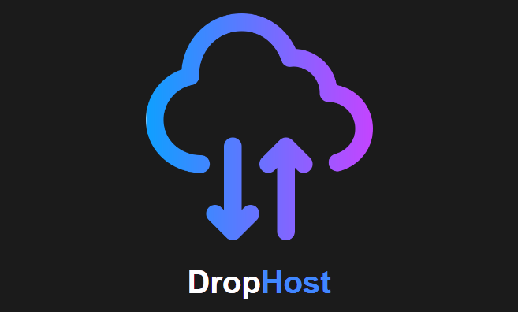

# DropHost 

Your self hosted file uploading server (NAS).



# What is DropHost? 

The DropHost server is basically used to create a self file hosted file uploading server or NAS ( Network attached storage ). Which is use to upload a file on a server computer and also manage these files with the help of a impressive web UI.

## Features

 - Easy to setup.
 - User friendly interface.
 - Authentication security.
 - Connect multiple devices.
 - Send the data to your server securely.

## Testing 

This tool is tested on :

- Windows
- MacOS
- Docker 
- Kali linux
- Ubuntu Server & Desktop


## Authors

- [dipanshu0104](https://github.com/dipanshu0104)


# Installation and requirments

- This tool require NodeJS and MongoDB.

## Installation

- Step 1. Clone the code by git clone. 

```bash  
git clone https://github.com/dipanshu0104/DropHost.git 
```
( You can also download the zip file directly. )

- Step 2. First download the required nodejs packages by these commands to go at the drophost folder path, And run these commands.

```bash  
npm install
npm install -g nodemon 
```
 or use pm2 to run the app

```bash  
npm install -g pm2
```

- Step 3. Start the mongodb server for storing the data. 

- Step 4. Now run the app.js file code using nodemon or you can run directly.

### Run using nodemon
```bash  
   npx nodemon 
```
### Run using Pm2
```bash  
   pm2 start ./app.js
// to stop the app
   pm2 stop ./app.js
```

### I hope you will use this Node.js  app very efficiently.